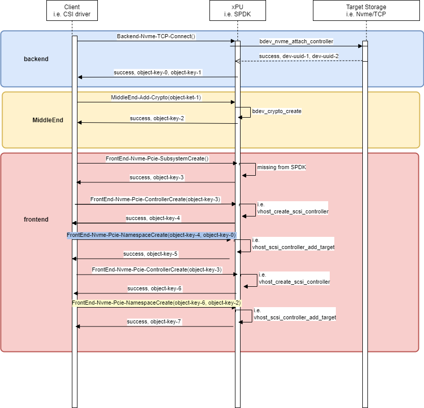

# OPI storage gRPC to SPDK json-rpc bridge

[](https://github.com/opiproject/opi-spdk-bridge/actions/workflows/linters.yml)
[](https://github.com/opiproject/opi-spdk-bridge/actions/workflows/poc-storage.yml)
[](https://github.com/opiproject/opi-spdk-bridge/blob/master/LICENSE)
[](https://github.com/opiproject/opi-spdk-bridge/releases)

This is a simple SPDK based storage API PoC.

* SPDK - container with SPDK app that is running on xPU
* Server - container with OPI gRPC storage APIs to SPDK json-rpc APIs bridge
* Client - container with OPI gRPC client for testing of the above server/bridge

## I Want To Contribute

This project welcomes contributions and suggestions.  We are happy to have the Community involved via submission of **Issues and Pull Requests** (with substantive content or even just fixes). We are hoping for the documents, test framework, etc. to become a community process with active engagement.  PRs can be reviewed by by any number of people, and a maintainer may accept.

See [CONTRIBUTING](https://github.com/opiproject/opi/blob/main/CONTRIBUTING.md) and [GitHub Basic Process](https://github.com/opiproject/opi/blob/main/doc-github-rules.md) for more details.

## Docs

* [JSON RPC Proxy](https://spdk.io/doc/jsonrpc_proxy.html)
* [SPDK SMA](https://github.com/spdk/spdk/tree/master/python/spdk/sma)
* [SPDK CSI](https://github.com/spdk/spdk-csi/blob/master/deploy/spdk/Dockerfile)
* [CSI Spec](https://github.com/container-storage-interface/spec/blob/master/spec.md)

## OPI-SPDK Bridge Block Diagram

The following is the example architecture we envision for the OPI Storage
SPDK bridge APIs. It utilizes SPDK to handle storage services,
and the configuration is handled by standard JSON-RPC based APIs
see <https://spdk.io/doc/jsonrpc.html>

We recongnise, not all companies use SPDK, so for them only PROTOBUF definitions
are going to be the OPI conumable product. For those that wish to use SPDK, this
is a refernce implementation not intended to use in production.


## OPI-SPDK Bridge Sequence Diagram

The following is the example sequence diagram for OPI-SPDK bridge APIs.
It is just an example and implies SPDK just as example, not mandated by OPI.



## Getting started

* [Setup everything once using ansible](https://github.com/opiproject/opi-poc/tree/main/setup)
* Run `docker-compose up -d`

## QEMU example

[OPI Storage QEMU SPDK Setup](qemu_spdk_setup.md)

## Real DPU/IPU example

on DPU/IPU (i.e. with IP=10.10.10.1) run

```bash
$ docker run --rm -it -v /var/tmp/:/var/tmp/ -p 50051:50051 ghcr.io/opiproject/opi-storage-server:main
2022/09/21 21:39:49 server listening at [::]:50051
```

on X86 management VM run

```bash
# subsystem apis
$ docker run --network=host --rm -it namely/grpc-cli call --json_input --json_output localhost:50051 NVMeSubsystemCreate "{'subsystem' : {'id' : {'value' : 'subsystem1'}, nqn: 'nqn.2022-09.io.spdk:opitest1'} }"
connecting to localhost:50051
{}
Rpc succeeded with OK status

$ docker run --network=host --rm -it namely/grpc-cli call --json_input --json_output localhost:50051 NVMeSubsystemList "{}"
connecting to localhost:50051
{
 "subsystem": [
  {
   "nqn": "nqn.2014-08.org.nvmexpress.discovery"
  },
  {
   "nqn": "nqn.2022-09.io.spdk:opi2"
  },
  {
   "nqn": "nqn.2016-06.io.spdk:cnode1"
  },
  {
   "nqn": "nqn.2022-09.io.spdk:opitest1"
  }
 ]
}
Rpc succeeded with OK status

$ docker run --network=host --rm -it namely/grpc-cli call --json_input --json_output localhost:50051 NVMeSubsystemGet "{'subsystem_id' : {'value' : 'subsystem1'} }"
connecting to localhost:50051
{
 "subsystem": {
  "nqn": "nqn.2022-09.io.spdk:opitest1"
 }
}
Rpc succeeded with OK status

$ docker run --network=host --rm -it namely/grpc-cli call --json_input --json_output localhost:50051 NVMeSubsystemDelete "{'subsystem_id' : {'value' : 'subsystem1'} }"
connecting to localhost:50051
{}
Rpc succeeded with OK status

# controller apis
$ docker run --network=host --rm -it namely/grpc-cli call --json_input --json_output localhost:50051 NVMeSubsystemCreate "{'subsystem' : {'id' : {'value' : 'subsystem2'}, nqn: 'nqn.2022-09.io.spdk:opitest2'} }"
connecting to localhost:50051
{}
Rpc succeeded with OK status

$ docker run --network=host --rm -it namely/grpc-cli call --json_input --json_output localhost:50051 NVMeControllerCreate "{'controller' : {'id' : {'value' : 'controller1'}, 'subsystem_id' : { 'value' : 'subsystem2' } } }"
connecting to localhost:50051
{}
Rpc succeeded with OK status
$ docker run --network=host --rm -it namely/grpc-cli call --json_input --json_output localhost:50051 NVMeControllerList "{}"
connecting to localhost:50051
{
 "controller": [
  {
   "id": {
    "value": "controller1"
   },
   "subsystemId": {
    "value": "subsystem2"
   }
  }
 ]
}
Rpc succeeded with OK status

$ docker run --network=host --rm -it namely/grpc-cli call --json_input --json_output localhost:50051 NVMeControllerGet "{'controller_id' : {'value' : 'controller1'} }"
connecting to localhost:50051
{
 "controller": {
  "id": {
   "value": "controller1"
  },
  "subsystemId": {
   "value": "subsystem2"
  }
 }
}
Rpc succeeded with OK status
$ docker run --network=host --rm -it namely/grpc-cli call --json_input --json_output localhost:50051 NVMeControllerDelete "{'controller_id' : {'value' : 'controller1'} }"
connecting to localhost:50051
{}
Rpc succeeded with OK status
$ docker run --network=host --rm -it namely/grpc-cli call --json_input --json_output localhost:50051 NVMeSubsystemDelete "{'subsystem_id' : {'value' : 'subsystem2'} }"
connecting to localhost:50051
{}
Rpc succeeded with OK status

# namespace apis
$ docker run --network=host --rm -it namely/grpc-cli call --json_input --json_output localhost:50051 NVMeSubsystemCreate "{'subsystem' : {'id' : {'value' : 'subsystem3'}, nqn: 'nqn.2022-09.io.spdk:opitest3'} }"
connecting to localhost:50051
{}
Rpc succeeded with OK status
$ docker run --network=host --rm -it namely/grpc-cli call --json_input --json_output localhost:50051 NVMeControllerCreate "{'controller' : {'id' : {'value' : 'controller2'}, 'subsystem_id' : { 'value' : 'subsystem3' } } }"
connecting to localhost:50051
{}
Rpc succeeded with OK status
$ docker run --network=host --rm -it namely/grpc-cli call --json_input --json_output localhost:50051 NVMeNamespaceCreate "{'namespace' : {'id' : {'value' : 'namespace1'}, 'subsystem_id' : { 'value' : 'subsystem3' }, 'controller_id' : { 'value' : 'controller2' }, 'host_nsid' : '1' } }"
connecting to localhost:50051
{}
$ docker run --network=host --rm -it namely/grpc-cli call --json_input --json_output localhost:50051 NVMeNamespaceList "{}"
connecting to localhost:50051
{
 "namespace": [
  {
   "hostNsid": 1
  }
 ]
}
Rpc succeeded with OK status
$ docker run --network=host --rm -it namely/grpc-cli call --json_input --json_output localhost:50051 NVMeNamespaceList "{'subsystem_id' : { 'value' : 'subsystem3' } }"
connecting to localhost:50051
{
 "namespace": [
  {
   "hostNsid": 1
  }
 ]
}
Rpc succeeded with OK status
$ docker run --network=host --rm -it namely/grpc-cli call --json_input --json_output localhost:50051 NVMeNamespaceGet "{'namespace_id' : {'value' : 'namespace1'} }"
connecting to localhost:50051
{
 "namespace": {
  "id": {
   "value": "namespace1"
  },
  "subsystemId": {
   "value": "subsystem3"
  },
  "controllerId": {
   "value": "controller2"
  },
  "hostNsid": 1
 }
}
Rpc succeeded with OK status
$ docker run --network=host --rm -it namely/grpc-cli call --json_input --json_output localhost:50051 NVMeNamespaceDelete "{'namespace_id' : {'value' : 'namespace1'} }"
connecting to localhost:50051
{}
Rpc succeeded with OK status
$ docker run --network=host --rm -it namely/grpc-cli call --json_input --json_output localhost:50051 NVMeControllerDelete "{'controller_id' : {'value' : 'controller2'} }"
connecting to localhost:50051
{}
Rpc succeeded with OK status
$ docker run --network=host --rm -it namely/grpc-cli call --json_input --json_output localhost:50051 NVMeSubsystemDelete "{'subsystem_id' : {'value' : 'subsystem3'} }"
connecting to localhost:50051
{}
Rpc succeeded with OK status
```

and netwok-facing APIs:

```bash
docker run --network=host --rm -it namely/grpc-cli call --json_input --json_output 10.10.10.1:50051 NVMfRemoteControllerConnect "{'ctrl' : {'id': '12', 'traddr':'11.11.11.2', 'subnqn':'nqn.2016-06.com.opi.spdk.target0', 'trsvcid':'4444'}}"
connecting to 10.10.10.1:50051
{}
Rpc succeeded with OK status

docker run --network=host --rm -it namely/grpc-cli call --json_input --json_output 10.10.10.1:50051 NVMfRemoteControllerGet "{'id': '12'}"
connecting to 10.10.10.1:50051
{
 "ctrl": {
  "subnqn": "OpiNvme12"
 }
}
Rpc succeeded with OK status

docker run --network=host --rm -it namely/grpc-cli call --json_input --json_output 10.10.10.1:50051 NVMfRemoteControllerDisconnect "{'id': '12'}"
connecting to 10.10.10.1:50051
{}
Rpc succeeded with OK status
```

## Test SPDK is up

```bash
curl -k --user spdkuser:spdkpass -X POST -H "Content-Type: application/json" -d '{"id": 1, "method": "bdev_get_bdevs", "params": {"name": "Malloc0"}}' http://127.0.0.1:9009/
```

## gRPC CLI examples

From <https://github.com/grpc/grpc-go/blob/master/Documentation/server-reflection-tutorial.md>

Alias

```bash
alias grpc_cli='docker run --network=opi-spdk-bridge_opi --rm -it namely/grpc-cli'
```

See services

```bash
$ grpc_cli ls opi-spdk-server:50051
grpc.reflection.v1alpha.ServerReflection
opi_api.storage.v1.AioControllerService
opi_api.storage.v1.NVMeControllerService
opi_api.storage.v1.NVMeNamespaceService
opi_api.storage.v1.NVMeSubsystemService
opi_api.storage.v1.NVMfRemoteControllerService
opi_api.storage.v1.NullDebugService
opi_api.storage.v1.VirtioBlkService
opi_api.storage.v1.VirtioScsiControllerService
opi_api.storage.v1.VirtioScsiLunService
```

See commands

```bash
 $ grpc_cli ls opi-spdk-server:50051 opi_api.storage.v1.NVMeControllerService -l
filename: frontend.proto
package: opi_api.storage.v1;
service NVMeControllerService {
  rpc NVMeControllerCreate(opi_api.storage.v1.NVMeControllerCreateRequest) returns (opi_api.storage.v1.NVMeController) {}
  rpc NVMeControllerDelete(opi_api.storage.v1.NVMeControllerDeleteRequest) returns (google.protobuf.Empty) {}
  rpc NVMeControllerUpdate(opi_api.storage.v1.NVMeControllerUpdateRequest) returns (opi_api.storage.v1.NVMeControllerUpdateResponse) {}
  rpc NVMeControllerList(opi_api.storage.v1.NVMeControllerListRequest) returns (opi_api.storage.v1.NVMeControllerListResponse) {}
  rpc NVMeControllerGet(opi_api.storage.v1.NVMeControllerGetRequest) returns (opi_api.storage.v1.NVMeControllerGetResponse) {}
  rpc NVMeControllerStats(opi_api.storage.v1.NVMeControllerStatsRequest) returns (opi_api.storage.v1.NVMeControllerStatsResponse) {}
}
```

See methods

```bash
grpc_cli ls opi-spdk-server:50051 opi_api.storage.v1.NVMeControllerService.NVMeControllerCreate -l
  rpc NVMeControllerCreate(opi_api.storage.v1.NVMeControllerCreateRequest) returns (opi_api.storage.v1.NVMeController) {}
```

See messages

```bash
$ grpc_cli type opi-spdk-server:50051 opi_api.storage.v1.NVMeController
message NVMeController {
  int64 id = 1 [json_name = "id"];
  string name = 2 [json_name = "name"];
  string subsystem_id = 3 [json_name = "subsystemId"];
  .opi_api.storage.v1.NvmeControllerPciId pcie_id = 4 [json_name = "pcieId"];
  int64 max_io_qps = 5 [json_name = "maxIoQps"];
  int64 max_ns = 6 [json_name = "maxNs"];
}

$ grpc_cli type opi-spdk-server:50051 opi_api.storage.v1.NvmeControllerPciId
message NvmeControllerPciId {
  uint32 bus = 1 [json_name = "bus"];
  uint32 device = 2 [json_name = "device"];
  uint32 function = 3 [json_name = "function"];
  uint32 virtual_function = 4 [json_name = "virtualFunction"];
}
```

Call remote method

```bash
$ grpc_cli call --json_input --json_output opi-spdk-server:50051 NVMeControllerDelete "{subsystem_id: 8}"
connecting to opi-spdk-server:50051
{}
Rpc succeeded with OK status
```

Server log

```bash
opi-spdk-server_1  | 2022/08/05 14:31:14 server listening at [::]:50051
opi-spdk-server_1  | 2022/08/05 14:39:40 NVMeSubsystemDelete: Received from client: id:8
opi-spdk-server_1  | 2022/08/05 14:39:40 Sending to SPDK: {"jsonrpc":"2.0","id":1,"method":"bdev_malloc_delete","params":{"name":"OpiMalloc8"}}
opi-spdk-server_1  | 2022/08/05 14:39:40 Received from SPDK: {1 {-19 No such device} 0xc000029f4e}
opi-spdk-server_1  | 2022/08/05 14:39:40 error: bdev_malloc_delete: json response error: No such device
opi-spdk-server_1  | 2022/08/05 14:39:40 Received from SPDK: false
opi-spdk-server_1  | 2022/08/05 14:39:40 Could not delete: id:8
```

Another remote call example

```bash
$ grpc_cli call --json_input --json_output opi-spdk-server:50051 NVMeSubsystemList {}
connecting to opi-spdk-server:50051
{
 "subsystem": [
  {
   "nqn": "nqn.2014-08.org.nvmexpress.discovery"
  },
  {
   "nqn": "nqn.2016-06.io.spdk:cnode1"
  }
 ]
}
Rpc succeeded with OK status
```

Another Server log

```bash
2022/09/21 19:38:26 NVMeSubsystemList: Received from client:
2022/09/21 19:38:26 Sending to SPDK: {"jsonrpc":"2.0","id":1,"method":"bdev_get_bdevs"}
2022/09/21 19:38:26 Received from SPDK: {1 {0 } 0x40003de660}
2022/09/21 19:38:26 Received from SPDK: [{Malloc0 512 131072 08cd0d67-eb57-41c2-957b-585faed7d81a} {Malloc1 512 131072 78c4b40f-dd16-42c1-b057-f95c11db7aaf}]
```
