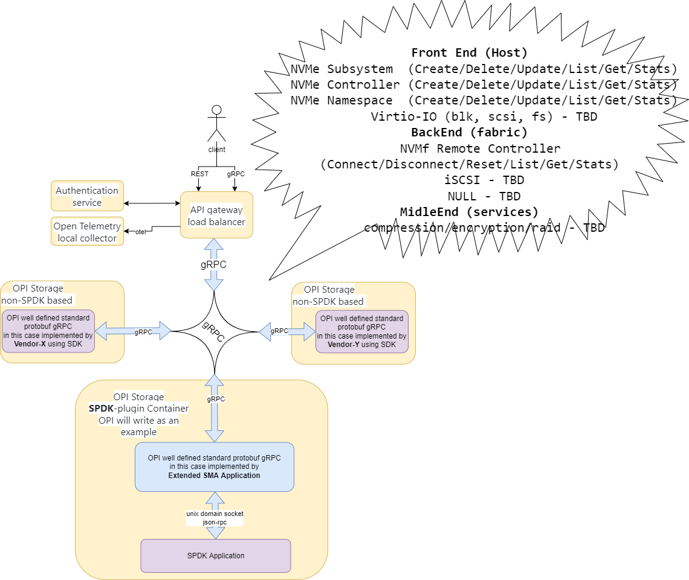
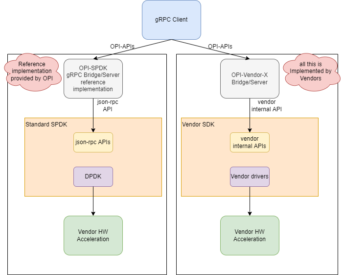

# Storage

This is a simple spdk based storage PoC

## Docs

* [JSON RPC Proxy](https://spdk.io/doc/jsonrpc_proxy.html)
* [SPDK SMA](https://github.com/spdk/spdk/tree/master/python/spdk/sma)
* [SPDK CSI](https://github.com/spdk/spdk-csi/blob/master/deploy/spdk/Dockerfile)
* [CSI Spec](https://github.com/container-storage-interface/spec/blob/master/spec.md)

## Diagram



## OPI-SPDK Bridge Diagram

The following is the example architecture we envision for the OPI Storage
SPDK bridge APIs. It utilizes SPDK to handle storage services,
and the configuration is handled by standard JSON-RPC based APIs
see <https://spdk.io/doc/jsonrpc.html>

We recongnise, not all companies use SPDK, so for them only PROTOBUF definitions
are going to be the OPI conumable product. For those that wish to use SPDK, this
is a refernce implementation not intended to use in production.



## QEMU example

[OPI Storage QEMU SPDK Setup](qemu_spdk_setup.md)

## Huge pages

SPDK requires huge pages, this is how you can configure this manually.

FYI `docker-compose` will do this for you.

```bash
sync
echo 1 | sudo tee /proc/sys/vm/drop_caches
sudo mkdir -p /mnt/huge
grep hugetlbfs /proc/mounts || sudo mount -t hugetlbfs nodev /mnt/huge
echo 1024 | sudo tee /proc/sys/vm/nr_hugepages
echo "Check and fail if not enough"
grep 1024 /sys/kernel/mm/hugepages/hugepages-2048kB/nr_hugepages
```

## Getting started

Run `docker-compose up -d`

## Test SPDK is up

```bash
curl -k --user spdkuser:spdkpass -X POST -H "Content-Type: application/json" -d '{"id": 1, "method": "bdev_get_bdevs", "params": {"name": "Malloc0"}}' http://127.0.0.1:9009/
```

## SPDK gRPC example

Optionally if you need to download modules

```bash
docker run --rm -it -v `pwd`:/app -w /app golang:alpine go get all
docker run --rm -it -v `pwd`:/app -w /app golang:alpine go get github.com/opiproject/opi-api/storage/proto
docker run --rm -it -v `pwd`:/app -w /app golang:alpine go mod tidy
```

Run example server (not for production) manually

```bash
   docker run --rm -it -v `pwd`:/app -w /app/server -p 50051:50051 golang:alpine go run jsonrpc.go frontend.go backend.go middleend.go server.go
```

Run example client (not for production) manually

```bash
   docker run --net=host --rm -it -v  `pwd`:/app -w /app/client golang:alpine go run frontend.go backend.go middleend.go client.go
```

Run both examples client and server via compose (not for production)

```bash
   docker-compose up opi-spdk-client
```

## gRPC CLI

From <https://github.com/grpc/grpc-go/blob/master/Documentation/server-reflection-tutorial.md>

Alias

```bash
alias grpc_cli='docker run --network=storage_opi --rm -it namely/grpc-cli'
```

See services

```bash
$ grpc_cli ls opi-spdk-server:50051
grpc.reflection.v1alpha.ServerReflection
opi.storage.v1.NVMeControllerService
opi.storage.v1.NVMeNamespaceService
opi.storage.v1.NVMeSubsystemService
opi.storage.v1.NVMfRemoteControllerService
opi.storage.v1.VirtioBlkService
```

See commands

```bash
 $ grpc_cli ls opi-spdk-server:50051 opi.storage.v1.NVMeControllerService -l
filename: frontend.proto
package: opi.storage.v1;
service NVMeControllerService {
  rpc NVMeControllerCreate(opi.storage.v1.NVMeControllerCreateRequest) returns (opi.storage.v1.NVMeControllerCreateResponse) {}
  rpc NVMeControllerDelete(opi.storage.v1.NVMeControllerDeleteRequest) returns (opi.storage.v1.NVMeControllerDeleteResponse) {}
  rpc NVMeControllerUpdate(opi.storage.v1.NVMeControllerUpdateRequest) returns (opi.storage.v1.NVMeControllerUpdateResponse) {}
  rpc NVMeControllerList(opi.storage.v1.NVMeControllerListRequest) returns (opi.storage.v1.NVMeControllerListResponse) {}
  rpc NVMeControllerGet(opi.storage.v1.NVMeControllerGetRequest) returns (opi.storage.v1.NVMeControllerGetResponse) {}
  rpc NVMeControllerStats(opi.storage.v1.NVMeControllerStatsRequest) returns (opi.storage.v1.NVMeControllerStatsResponse) {}
}
```

See methods

```bash
grpc_cli ls opi-spdk-server:50051 opi.storage.v1.NVMeControllerService.NVMeControllerCreate -l
  rpc NVMeControllerCreate(opi.storage.v1.NVMeControllerCreateRequest) returns (opi.storage.v1.NVMeControllerCreateResponse) {}
```

See messages

```bash
$ grpc_cli type opi-spdk-server:50051 opi.storage.v1.NVMeController
message NVMeController {
  int64 id = 1 [json_name = "id"];
  string name = 2 [json_name = "name"];
  string subsystem_id = 3 [json_name = "subsystemId"];
  string pcie_id = 4 [json_name = "pcieId"];
  int64 max_io_qps = 5 [json_name = "maxIoQps"];
  int64 max_ns = 6 [json_name = "maxNs"];
}
```

Call remote method

```bash
$ grpc_cli call opi-spdk-server:50051 NVMeControllerDelete "subsystem_id: 8"
connecting to opi-spdk-server:50051
Rpc succeeded with OK status
```

Server log

```bash
opi-spdk-server_1  | 2022/08/05 14:31:14 server listening at [::]:50051
opi-spdk-server_1  | 2022/08/05 14:39:40 NVMeSubsystemDelete: Received from client: id:8
opi-spdk-server_1  | 2022/08/05 14:39:40 Sending to SPDK: {"jsonrpc":"2.0","id":1,"method":"bdev_malloc_delete","params":{"name":"OpiMalloc8"}}
opi-spdk-server_1  | 2022/08/05 14:39:40 Received from SPDK: {1 {-19 No such device} 0xc000029f4e}
opi-spdk-server_1  | 2022/08/05 14:39:40 error: bdev_malloc_delete: json response error: No such device
opi-spdk-server_1  | 2022/08/05 14:39:40 Received from SPDK: false
opi-spdk-server_1  | 2022/08/05 14:39:40 Could not delete: id:8
```

Another remote call example

```bash
$ grpc_cli call opi-spdk-server:50051 NVMeSubsystemList ""
connecting to opi-spdk-server:50051
subsystem {
  nqn: "Malloc0"
}
subsystem {
  nqn: "Malloc1"
}
Rpc succeeded with OK status
```

Another Server log

```bash
2022/09/21 19:38:26 NVMeSubsystemList: Received from client:
2022/09/21 19:38:26 Sending to SPDK: {"jsonrpc":"2.0","id":1,"method":"bdev_get_bdevs"}
2022/09/21 19:38:26 Received from SPDK: {1 {0 } 0x40003de660}
2022/09/21 19:38:26 Received from SPDK: [{Malloc0 512 131072 08cd0d67-eb57-41c2-957b-585faed7d81a} {Malloc1 512 131072 78c4b40f-dd16-42c1-b057-f95c11db7aaf}]
```
