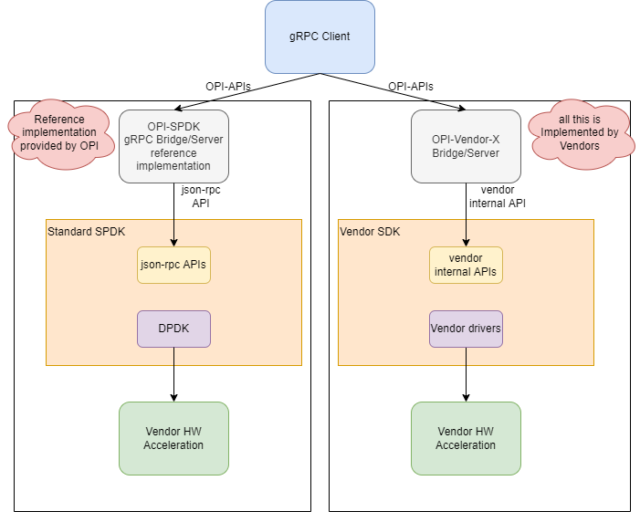

# OPI storage gRPC to SPDK json-rpc bridge

[](https://github.com/opiproject/opi-spdk-bridge/actions/workflows/linters.yml)
[](https://github.com/opiproject/opi-spdk-bridge/actions/workflows/docker-publish.yml)
[](https://github.com/opiproject/opi-spdk-bridge/blob/master/LICENSE)
[](https://codecov.io/gh/opiproject/opi-spdk-bridge)
[](https://goreportcard.com/report/github.com/opiproject/opi-spdk-bridge)
[](http://godoc.org/github.com/opiproject/opi-spdk-bridge)
[](https://github.com/opiproject/opi-spdk-bridge/releases)

This is a simple SPDK based storage API PoC.

* SPDK - container with SPDK app that is running on xPU
* Server - container with OPI gRPC storage APIs to SPDK json-rpc APIs bridge
* Client - use [goDPU](https://github.com/opiproject/godpu) for testing of the above server/bridge

## I Want To Contribute

This project welcomes contributions and suggestions.  We are happy to have the Community involved via submission of **Issues and Pull Requests** (with substantive content or even just fixes). We are hoping for the documents, test framework, etc. to become a community process with active engagement.  PRs can be reviewed by by any number of people, and a maintainer may accept.

See [CONTRIBUTING](https://github.com/opiproject/opi/blob/main/CONTRIBUTING.md) and [GitHub Basic Process](https://github.com/opiproject/opi/blob/main/doc-github-rules.md) for more details.

## Docs

* [JSON RPC Proxy](https://spdk.io/doc/jsonrpc_proxy.html)
* [SPDK SMA](https://github.com/spdk/spdk/tree/master/python/spdk/sma)
* [SPDK CSI](https://github.com/spdk/spdk-csi/blob/master/deploy/spdk/Dockerfile)
* [CSI Spec](https://github.com/container-storage-interface/spec/blob/master/spec.md)

## OPI-SPDK Bridge Block Diagram

The following is the example architecture we envision for the OPI Storage
SPDK bridge APIs. It utilizes SPDK to handle storage services,
and the configuration is handled by standard JSON-RPC based APIs
see <https://spdk.io/doc/jsonrpc.html>

We recongnise, not all companies use SPDK, so for them only PROTOBUF definitions
are going to be the OPI conumable product. For those that wish to use SPDK, this
is a refernce implementation not intended to use in production.



## OPI-SPDK Bridge Sequence Diagram

The following is the example sequence diagram for OPI-SPDK bridge APIs.
It is just an example and implies SPDK just as example, not mandated by OPI.


## Getting started

* [Setup everything once using ansible](https://github.com/opiproject/opi-poc/tree/main/setup)
* Run `docker-compose up -d`

## QEMU example

[OPI Storage QEMU SPDK Setup](qemu_spdk_setup.md)

## Real DPU/IPU example

on DPU/IPU (i.e. with IP=10.10.10.1) run

```bash
$ docker run --rm -it -v /var/tmp/:/var/tmp/ -p 50051:50051 ghcr.io/opiproject/opi-spdk-bridge:main
2022/09/21 21:39:49 server listening at [::]:50051
```

on X86 management VM run

```bash
docker run --network=host --rm -it namely/grpc-cli ls   --json_input --json_output 10.10.10.10:50051 -l
docker run --network=host --rm -it namely/grpc-cli call --json_input --json_output 10.10.10.10:50051 CreateNVMeSubsystem "{nv_me_subsystem : {spec : {id : {value : 'subsystem2'}, nqn: 'nqn.2022-09.io.spdk:opitest2', serial_number: 'myserial2', model_number: 'mymodel2', max_namespaces: 11} } }"
docker run --network=host --rm -it namely/grpc-cli call --json_input --json_output 10.10.10.10:50051 ListNVMeSubsystems "{}"
docker run --network=host --rm -it namely/grpc-cli call --json_input --json_output 10.10.10.10:50051 GetNVMeSubsystem "{name : 'subsystem2'}"
docker run --network=host --rm -it namely/grpc-cli call --json_input --json_output 10.10.10.10:50051 CreateNVMeController "{nv_me_controller : {spec : {id : {value : 'controller1'}, nvme_controller_id: 2, subsystem_id : { value : 'subsystem2' }, pcie_id : {physical_function : 0}, max_nsq:5, max_ncq:5 } } }"
docker run --network=host --rm -it namely/grpc-cli call --json_input --json_output 10.10.10.10:50051 ListNVMeControllers "{parent : 'subsystem2'}"
docker run --network=host --rm -it namely/grpc-cli call --json_input --json_output 10.10.10.10:50051 GetNVMeController "{name : 'controller1'}"
docker run --network=host --rm -it namely/grpc-cli call --json_input --json_output 10.10.10.10:50051 CreateNVMeNamespace "{nv_me_namespace : {spec : {id : {value : 'namespace1'}, subsystem_id : { value : 'subsystem2' }, volume_id : { value : 'Malloc0' }, 'host_nsid' : '10', uuid:{value : '1b4e28ba-2fa1-11d2-883f-b9a761bde3fb'}, nguid: '1b4e28ba-2fa1-11d2-883f-b9a761bde3fb', eui64: 1967554867335598546 } } }"
docker run --network=host --rm -it namely/grpc-cli call --json_input --json_output 10.10.10.10:50051 ListNVMeNamespaces "{parent : 'subsystem2'}"
docker run --network=host --rm -it namely/grpc-cli call --json_input --json_output 10.10.10.10:50051 GetNVMeNamespace "{name : 'namespace1'}"
docker run --network=host --rm -it namely/grpc-cli call --json_input --json_output 10.10.10.10:50051 NVMeNamespaceStats "{namespace_id : {value : 'namespace1'} }"
docker run --network=host --rm -it namely/grpc-cli call --json_input --json_output 10.10.10.10:50051 CreateNVMfRemoteController "{nv_mf_remote_controller : {id: {value : 'NvmeTcp12'}, traddr:'11.11.11.2', subnqn:'nqn.2016-06.com.opi.spdk.target0', trsvcid:'4444', trtype:'NVME_TRANSPORT_TCP', adrfam:'NVMF_ADRFAM_IPV4', hostnqn:'nqn.2014-08.org.nvmexpress:uuid:feb98abe-d51f-40c8-b348-2753f3571d3c'}}"
docker run --network=host --rm -it namely/grpc-cli call --json_input --json_output 10.10.10.10:50051 ListNVMfRemoteControllers "{}"
docker run --network=host --rm -it namely/grpc-cli call --json_input --json_output 10.10.10.10:50051 GetNVMfRemoteController "{name: 'NvmeTcp12'}"
docker run --network=host --rm -it namely/grpc-cli call --json_input --json_output 10.10.10.10:50051 DeleteNVMfRemoteController "{name: 'NvmeTcp12'}"
docker run --network=host --rm -it namely/grpc-cli call --json_input --json_output 10.10.10.10:50051 DeleteNVMeNamespace "{name : 'namespace1'}"
docker run --network=host --rm -it namely/grpc-cli call --json_input --json_output 10.10.10.10:50051 DeleteNVMeController "{name : 'controller1'}"
docker run --network=host --rm -it namely/grpc-cli call --json_input --json_output 10.10.10.10:50051 DeleteNVMeSubsystem "{name : 'subsystem2'}"
```

## Test SPDK is up

```bash
curl -k --user spdkuser:spdkpass -X POST -H "Content-Type: application/json" -d '{"id": 1, "method": "bdev_get_bdevs", "params": {"name": "Malloc0"}}' http://127.0.0.1:9009/
```

## gRPC CLI examples

From <https://github.com/grpc/grpc-go/blob/master/Documentation/server-reflection-tutorial.md>

Alias

```bash
alias grpc_cli='docker run --network=opi-spdk-bridge_opi --rm -it namely/grpc-cli'
```

See services

```bash
$ grpc_cli ls opi-spdk-server:50051
grpc.reflection.v1alpha.ServerReflection
opi_api.storage.v1.AioControllerService
opi_api.storage.v1.FrontendNvmeService
opi_api.storage.v1.FrontendVirtioBlkService
opi_api.storage.v1.FrontendVirtioScsiService
opi_api.storage.v1.MiddleendService
opi_api.storage.v1.NVMfRemoteControllerService
opi_api.storage.v1.NullDebugService
```

See commands

```bash
$ grpc_cli ls opi-spdk-server:50051 opi_api.storage.v1.FrontendNvmeService -l
filename: frontend_nvme_pcie.proto
package: opi_api.storage.v1;
service FrontendNvmeService {
  rpc CreateNVMeSubsystem(opi_api.storage.v1.CreateNVMeSubsystemRequest) returns (opi_api.storage.v1.NVMeSubsystem) {}
  rpc DeleteNVMeSubsystem(opi_api.storage.v1.DeleteNVMeSubsystemRequest) returns (google.protobuf.Empty) {}
  rpc UpdateNVMeSubsystem(opi_api.storage.v1.UpdateNVMeSubsystemRequest) returns (opi_api.storage.v1.NVMeSubsystem) {}
  rpc ListNVMeSubsystem(opi_api.storage.v1.ListNVMeSubsystemRequest) returns (opi_api.storage.v1.ListNVMeSubsystemResponse) {}
  rpc GetNVMeSubsystem(opi_api.storage.v1.GetNVMeSubsystemRequest) returns (opi_api.storage.v1.NVMeSubsystem) {}
  rpc NVMeSubsystemStats(opi_api.storage.v1.NVMeSubsystemStatsRequest) returns (opi_api.storage.v1.NVMeSubsystemStatsResponse) {}
  rpc CreateNVMeController(opi_api.storage.v1.CreateNVMeControllerRequest) returns (opi_api.storage.v1.NVMeController) {}
  rpc DeleteNVMeController(opi_api.storage.v1.DeleteNVMeControllerRequest) returns (google.protobuf.Empty) {}
  rpc UpdateNVMeController(opi_api.storage.v1.UpdateNVMeControllerRequest) returns (opi_api.storage.v1.NVMeController) {}
  rpc ListNVMeController(opi_api.storage.v1.ListNVMeControllerRequest) returns (opi_api.storage.v1.ListNVMeControllerResponse) {}
  rpc GetNVMeController(opi_api.storage.v1.GetNVMeControllerRequest) returns (opi_api.storage.v1.NVMeController) {}
  rpc NVMeControllerStats(opi_api.storage.v1.NVMeControllerStatsRequest) returns (opi_api.storage.v1.NVMeControllerStatsResponse) {}
  rpc CreateNVMeNamespace(opi_api.storage.v1.CreateNVMeNamespaceRequest) returns (opi_api.storage.v1.NVMeNamespace) {}
  rpc DeleteNVMeNamespace(opi_api.storage.v1.DeleteNVMeNamespaceRequest) returns (google.protobuf.Empty) {}
  rpc UpdateNVMeNamespace(opi_api.storage.v1.UpdateNVMeNamespaceRequest) returns (opi_api.storage.v1.NVMeNamespace) {}
  rpc ListNVMeNamespace(opi_api.storage.v1.ListNVMeNamespaceRequest) returns (opi_api.storage.v1.ListNVMeNamespaceResponse) {}
  rpc GetNVMeNamespace(opi_api.storage.v1.GetNVMeNamespaceRequest) returns (opi_api.storage.v1.NVMeNamespace) {}
  rpc NVMeNamespaceStats(opi_api.storage.v1.NVMeNamespaceStatsRequest) returns (opi_api.storage.v1.NVMeNamespaceStatsResponse) {}
}
```

See methods

```bash
$ grpc_cli ls opi-spdk-server:50051 opi_api.storage.v1.FrontendNvmeService.CreateNVMeController -l
  rpc CreateNVMeController(opi_api.storage.v1.CreateNVMeControllerRequest) returns (opi_api.storage.v1.NVMeController) {}
```

See messages

```bash
$ grpc_cli type opi-spdk-server:50051 opi_api.storage.v1.NVMeControllerSpec
message NVMeControllerSpec {
  .opi_api.common.v1.ObjectKey id = 1 [json_name = "id"];
  int32 nvme_controller_id = 2 [json_name = "nvmeControllerId"];
  .opi_api.common.v1.ObjectKey subsystem_id = 3 [json_name = "subsystemId"];
  .opi_api.storage.v1.PciEndpoint pcie_id = 4 [json_name = "pcieId"];
  int32 max_nsq = 5 [json_name = "maxNsq"];
  int32 max_ncq = 6 [json_name = "maxNcq"];
  int32 sqes = 7 [json_name = "sqes"];
  int32 cqes = 8 [json_name = "cqes"];
  int32 max_namespaces = 9 [json_name = "maxNamespaces"];
}

$ grpc_cli type opi-spdk-server:50051 opi_api.storage.v1.PciEndpoint
message PciEndpoint {
  int32 port_id = 1 [json_name = "portId"];
  int32 physical_function = 2 [json_name = "physicalFunction"];
  int32 virtual_function = 3 [json_name = "virtualFunction"];
}
```

Call remote method

```bash
$ grpc_cli call --json_input --json_output opi-spdk-server:50051 DeleteNVMeController "{subsystem_id: 8}"
connecting to opi-spdk-server:50051
{}
Rpc succeeded with OK status
```

Server log

```bash
opi-spdk-server_1  | 2022/08/05 14:31:14 server listening at [::]:50051
opi-spdk-server_1  | 2022/08/05 14:39:40 DeleteNVMeSubsystem: Received from client: id:8
opi-spdk-server_1  | 2022/08/05 14:39:40 Sending to SPDK: {"jsonrpc":"2.0","id":1,"method":"bdev_malloc_delete","params":{"name":"OpiMalloc8"}}
opi-spdk-server_1  | 2022/08/05 14:39:40 Received from SPDK: {1 {-19 No such device} 0xc000029f4e}
opi-spdk-server_1  | 2022/08/05 14:39:40 error: bdev_malloc_delete: json response error: No such device
opi-spdk-server_1  | 2022/08/05 14:39:40 Received from SPDK: false
opi-spdk-server_1  | 2022/08/05 14:39:40 Could not delete: id:8
```

Another remote call example

```bash
$ grpc_cli call --json_input --json_output opi-spdk-server:50051 ListNVMeSubsystem {}
connecting to opi-spdk-server:50051
{
 "subsystem": [
  {
   "nqn": "nqn.2014-08.org.nvmexpress.discovery"
  },
  {
   "nqn": "nqn.2016-06.io.spdk:cnode1"
  }
 ]
}
Rpc succeeded with OK status
```

Another Server log

```bash
2022/09/21 19:38:26 ListNVMeSubsystem: Received from client:
2022/09/21 19:38:26 Sending to SPDK: {"jsonrpc":"2.0","id":1,"method":"bdev_get_bdevs"}
2022/09/21 19:38:26 Received from SPDK: {1 {0 } 0x40003de660}
2022/09/21 19:38:26 Received from SPDK: [{Malloc0 512 131072 08cd0d67-eb57-41c2-957b-585faed7d81a} {Malloc1 512 131072 78c4b40f-dd16-42c1-b057-f95c11db7aaf}]
```
